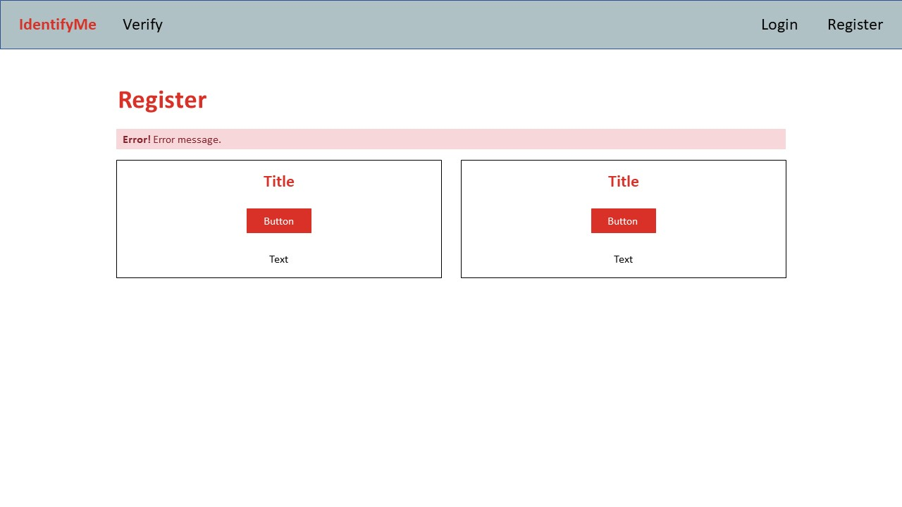
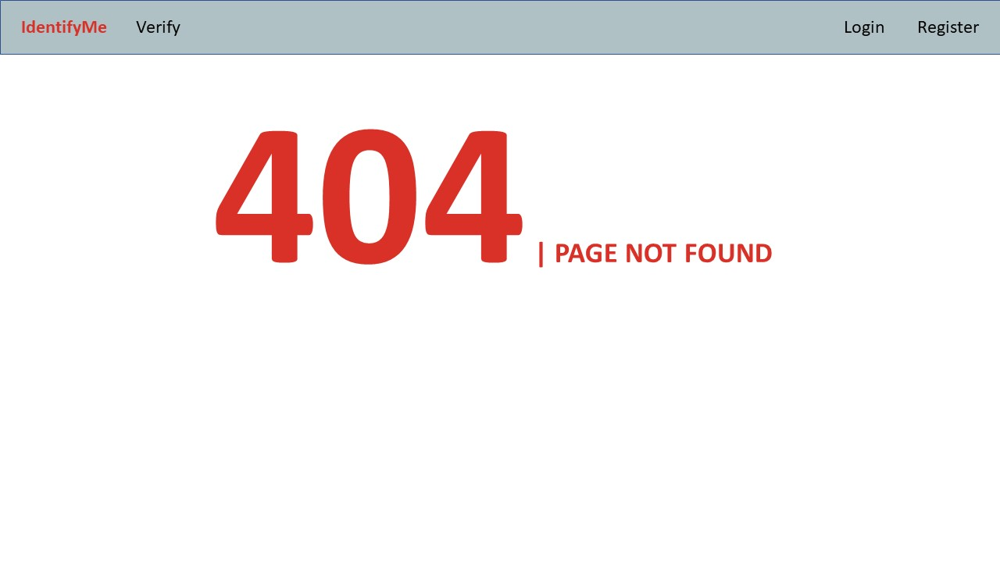

# ndi-tap-2023

#### NDI TAP Assessment 2023

For this technical assessment, I will be developing a fullstack project. This project is a prototype that solves problem
statement defined below, written in Node.js with JavaScript, using Pug template engine, Express.js framework for
backend, and basic data manipulation with SQLite3.

This application is also deployed and hosted on [Heroku](https://ndi-tap-2023.herokuapp.com/).

#### Author: Loh Chun Mun

## Table of Contents

- [Problem Statement](#problem-statement)
- [Proposed Solution](#proposed-solution)
- [Future Improvements](#future-improvements)
- [Architecture](#architecture)
    - [CI/CD (GitHub Actions)](#cicd-github-actions)
    - [Unit Test](#unit-test)
    - [Code Coverage](#code-coverage)
    - [Containerise (Docker)](#containerise-docker)
- [Wireframe](#wireframe)
- [API Documentation](#api-documentation)
    1. [Create Profile](#1-create-profile)
    2. [Get Profile](#2-get-profile)
- [Start the Application](#start-the-application)
    1. [Node](#1-node)
    2. [Docker](#2-docker)
- [Setup Guide (Local)](#setup-guide-local)
    1. [Node.js](#1-nodejs)
    2. [Docker (Optional)](#2-docker-optional)
    3. [Process Environment Variables](#3-process-environment-variables-env)
- [npm Commands](#npm-commands)
    - [npm ci](#npm-ci)
    - [npm start](#npm-start)
    - [npm run dev](#npm-run-dev)
    - [npm run test](#npm-run-test)
- [Dependencies](#dependencies)

## Problem Statement

Over the recent years, scams in Singapore are becoming more and more sophisticated.
Such scams could come in many forms, but the common scams can be categorised under:

- Call scam
    - These scams often involves the scammers trying to pry into the victims' personal/sensitive information in order to
      obtain access into their bank accounts.
- Job scam
    - These scams often involves the scammers sending recruitment ads through messaging apps such as WhatsApp or
      Telegram, enticing unsuspecting victims by promising high pay with short working hours. The victims will be
      required to fork out their own money at some point in time, and eventually be rug pulled.
- Online Marketplace scam
    - These scams often involves the scammers pretending to sell goods at a significantly cheaper price point than
      anywhere else. These scammers will not deliver the goods that the victims have paid for, and often they will go
      missing after the victim has paid.
- Donation scam
    - These scams often involves the scammers pretending to be a part of charitable organisations and asking victims for
      donations.

Although there are campaigns which aims to educate Singaporeans on these common scams, it is simply one part of a
deterrence and may not be enough to curb the sophisticated scams that scammers have been developing.

## Proposed Solution

As such, I would like to propose **IdentifyMe**, a platform that allows _individuals_ or _business representatives_ to
guarantee their identity during their exchange with the customers.

_Individuals_ may apply for an identification profile by applying with MyInfo. Registered businesses will be able to
apply
for such identification profiles on behalf of their employees by applying with MyInfo Business. These applications will
be instantly approved as their identities are guaranteed by MyInfo.

Similar to an NRIC or driver license, these identification profiles will be locally recognised as a legal form of
identification. These identification profiles will be used for professional contexts, and will only contain information
that is safe for the public to see.

Every identification profile will have a photo of the individual, an identification code, their full name, the
entity that they are representing (if applicable).

The customer must be allowed to enter the identification code on the platform. The platform should display the exact
same identification profile.

My solution aims to provide Singaporeans with a method to verify the identity of any individual or business
representative in local context. On the other hand, these _individuals_ or _business representatives_ can safely assure
their customers with ease, allowing better conversations to happen.

## Future Improvements

Due to time constraints, the proposed solution is only a bare-bone prototype. If time is not a constraint, I would 
suggest adding a dynamically generated QR code on the profile, where the customer can simply scan the QR code to be 
shown the same identification profile of the _individuals_ or _business representative_ on their own devices.

Simultaneously, this interaction will be logged under the customer's "contact history" to facilitate swift tracking of
the individual or business representative when necessary. The customer will immediately receive a notification that
the interaction with the _individuals_ or _business representative_ has been logged. Thus, if no notification was
received after entering the code or scanning the QR, there is a chance that they might have encountered a fake 
identification profile.

The end goal for this would be to develop this solution as a native app for smartphones is recommended, as it will be 
trickier for scammers to attempt to replicate the platform in order to create a "phishing site" to fake their 
identification profiles.

## Architecture


### CI/CD (GitHub Actions)

This project is supported by a CI/CD pipeline workflow. The entire process starting from the moment the code is pushed
onto this repository, to the deployment on Heroku, including build and publish of Docker image, are fully automated.

The CI/CD process begins with the workflow process on **GitHub Actions**. Click [here](./.github/workflows/node.yml) to 
view the YAML file.

Upon pushing into the "main" branch, the CI workflow will be automatically triggered, beginning with checking out the
repository so that the workflow can access it. The CI attempt to install all necessary dependencies and run the [unit
testings (test)](#unit-test). When the tests are completed, it will export the code coverage report as an 
artifact, which can be downloaded from the "Summary" of each completed workflow process.

When the CI workflow passes, the codes will be pushed to Heroku automatically. Heroku will take instructions
from [heroku.yml](./heroku.yml), build and publish the docker image, and run the containerised application on a Heroku 
Dyno.

And that encompasses the entire continuous integration and deployment workflow of this app!

### Unit Test

Unit tests have been written to test each of the app's URIs and API endpoints, ensuring that correct HTTP status code 
returns, all responses are returns intended and in proper format, and that exceptions are handled properly. 
In order to achieve this, I picked a combination of [Mocha.js](https://mochajs.org/) and 
[Chai.js](https://www.chaijs.com/) framework, which are commonly used together for writing Node.js unit testing. 
On top of these, it was also necessary to install [Chai HTTP](https://www.chaijs.com/plugins/chai-http/) to support 
HTTP integration testing with Chai assertions.

To ensure that the unit tests are covering as many segments of the codes as possible, I have used a code coverage
tester, [Istanbul / nyc](https://istanbul.js.org/), as a means to ensure my codebase are well tested by my unit tests.

During the testing, the application automatically swaps to a test database, such that the production database will be
left untouched. Seed data is created at the start of the test and dropped at the end of testing.

### Code Coverage

As mentioned in the [Unit Test](#unit-test) section, a code coverage report is generated at the end of the CI 
workflow, which can be downloaded from the workflow summary tab. A code coverage allowed me to write unit tests that
covers all possible segments of the code, ensuring that all request and responses are submitted and returned as
intended.

### Containerise (Docker)

To avoid the common issue of an application failing to run on other devices, it is important to containerise the
application by isolating the application into an image using Docker. The app will then run on the container, which
contains an operating system and the supporting software. The script that instructs Docker on how to set up the app
is located [here](./Dockerfile).

## Wireframe

**Home Page**

URL: `/` or `/index`


**Verify Page**

URL: `/verify`


**Verify Page (Not Found)**

URL: `/verify?result&search`


**Profile Card**

URL: `/profileCard?code`


**Login Page**

URL: `/login`


**Register Page**

URL: `/register`


**Register Page (Error)**

URL: `/register?result`


**MyInfo Registration**

URL: `/myinfo` 


**MyInfo Business Registration**

URL: `/myinfoBusiness`


**Error Page**

URL: Any invalid URLs


## API Documentation
This API returns responses in JSON format. Please ensure that `Content-Type: application/json` or 
`application/x-www-form-urlencoded` is set in the request header and request body conforms to either.

When a request is sent to an invalid endpoint, a `404` status code will be return with the following JSON response body:
```json
{
    "message": "API endpoint not found"
}
```

### 1. Create Profile
```http request
POST /api/createProfile
```
#### Request Body:
```javascript
{
    "code"          : String,
    "fullName"      : String,
    "sex"           : String,
    "race"          : String,
    "email"         : String,
    "nric"          : String,
    "entityName"?   : String,
    "UEN"?          : String
}
```
| Parameter    | Type     | Description                                                                                   |
|:-------------|:---------|:----------------------------------------------------------------------------------------------|
| `code`       | `string` | **Required**. Identification code that represents a person profile. Field must be **UNIQUE**. |
| `fullName`   | `string` | **Required**. Full name of the applicant.                                                     |
| `sex`        | `string` | **Required**. Gender of the applicant.                                                        |
| `race`       | `string` | **Required**. Race of the applicant.                                                          |
| `email`      | `string` | **Required**. Email of the applicant.                                                         |
| `nric`       | `string` | **Required**. NRIC of the applicant.                                                          |
| `entityName` | `string` | **Optional**. Name of the entity that the applicant is representing.                          |
| `UEN`        | `string` | **Optional**. UEN of the entity that the applicant is representing.                           |

#### Success Response:
```javascript
{
    "id": Number
}
```

#### Error Response:
```json
{}
```

### 2. Get Profile
```http request
GET /api/getProfile/:code
```
| Parameter | Type     | Description                                                             |
|:----------|:---------|:------------------------------------------------------------------------|
| `:code`   | `String` | **Required**. Identification `code` that uniquely identifies a profile. |

#### Success Response:
```javascript
{
    "id": Number,
    "code": String,
    "fullName": String,
    "sex": String,
    "race": String,
    "email": String,
    "nric": String,
    "entityName": String | null,
    "UEN": String | null
}
```

#### Error Response:
```json
{}
```

## Start the Application

Choose only one of the two following methods below to start the app. Once the app is running, you should be able to 
access it via `http://localhost:3000`. If you have issues with starting or running the app, please refer to the 
[setup guide](#setup-guide-local) below.

### 1. Node

A batch and shell script has been created for your convenience. The script will attempt to set any process environment
variables before executing `npm start`. Remember to run `npm ci` in the before executing the batch or shell script. You
may find out more about the npm commands [here](#npm-commands).

You may simply execute the following command to start the application:

#### For Windows

```shell
.\start.bat
```

#### For Linux/MacOS

```shell
./start.sh
```

> **NOTE:** Uncomment the `PORT` in the batch or shell script to set the application to run on an available port of your
> choice.

### 2. Docker

Execute the two following commands, one after another:

#### For Windows

```shell
# docker build -t <name_for_image> .
docker build -t ndi-tap-2023 .

# docker run -d -p <Browser_expose_port>:<application port> <image_id/name>
docker run --env URI_IGNORE_PORT=0 -d -p 3000:3000 ndi-tap-2023
```

#### For Linux/MacOS

```shell
# sudo docker build -t <name_for_image> .
sudo docker build -t ndi-tap-2023 .

# sudo docker run -d -p <Browser_expose_port>:<application port> <image_id/name>
sudo docker run --env URI_IGNORE_PORT=0 -d -p 3000:3000 ndi-tap-2023
```

## Setup Guide (Local)

Needless to say, please clone the project first before proceeding.

### 1. Node.js

To run this project locally, you must have Node.js installed on your device. A quick way to get started is to directly
install Node.js on your system. You may download the installer [here](https://nodejs.org/en/download/).

However, it is strongly recommended to use a Node version manager such
as [nvm](https://github.com/nvm-sh/nvm#installing-and-updating)
to install Node.js and npm. You may read more about
it [here](https://docs.npmjs.com/downloading-and-installing-node-js-and-npm).

### 2. Docker (Optional)

You may choose to containerise this application and run it on Docker. To do so, download and install
Docker [here](https://docs.docker.com/desktop/install/windows-install/).

### 3. Process Environment Variables `.env`

Before running the app and unit test, you may configure the following optional process environment variable(s).

```
URI_IGNORE_PORT=0
ENV=test
PORT=3000
```

| Parameters        | Type     | Description                                                                                                                                                                                       |
|:------------------|:---------|:--------------------------------------------------------------------------------------------------------------------------------------------------------------------------------------------------|
| `URI_IGNORE_PORT` | `Number` | **Required**. Set `1` if the port is not required. By default, you should set to `0` when running locally or when the port is necessary. Live deployment may require this value to be set to `1`. |
| `ENV`             | `String` | **Optional**. Set value to `test` for unit testing only.                                                                                                                                          |
| `PORT`            | `Number` | **Optional**. Specify the port that your app will run on. By default, it is set to 3000.                                                                                                          |

## npm Commands

Here, we have a list of CLI commands that may be useful to you. In the project directory, simply open a terminal to run
the following:

### `npm ci`

- This command will install all necessary dependencies based on the `package-lock.json`.
- You only need to run this command <b>once</b> in the project directory.

### `npm start`

- This command starts the node server located in the root of the repository.
- Alternatively, you may run `node app.js`.
- You can now access the app through `localhost:3000`.

### `npm run dev`

- This command starts the node server in development mode using nodemon.
- It will monitor for any changes to the JavaScript files and restart the node server when changes are observed.
- Alternatively, you may run `nodemon app.js`
- For more info, please refer to [Nodemon](https://github.com/remy/nodemon#nodemon).

### `npm run test`

- This command runs the unit tests and generates a code coverage report.
- Code coverage report are generated in `./coverage`, in HTML format for ease of readability.
- Alternatively, you may run `nyc --reporter=html --reporter=text mocha test/test.js --exit"`
- For more info, you may read up on them in their official documentations: [Istanbul / nyc](https://istanbul.js.org/)
  , [Mocha.js](https://mochajs.org/), [Chai.js](https://www.chaijs.com/).

## Dependencies

#### Running on Node v16.13.1

Refer to [package-lock.json](./package-lock.json) for all the nitty-gritty details, or refer to the following for a
summarised list taken from [package.json](./package.json):
```json5
    "dependencies": {
        "body-parser": "^1.20.0",
        "bootstrap": "^5.2.0",
        "cors": "^2.8.5",
        "express": "^4.18.1",
        "jquery": "^3.6.0",
        "knex": "^2.2.0",
        "lodash": "^4.17.21",
        "morgan": "^1.10.0",
        "pug": "^3.0.2",
        "random-name": "^0.1.2",
        "randomstring": "^1.2.2",
        "request": "^2.88.2",
        "sqlite3": "^5.0.11"
    },
    "devDependencies": {
        "chai": "^4.3.6",
        "chai-http": "^4.3.0",
        "mocha": "^10.0.0",
        "nodemon": "^2.0.19",
        "nyc": "^15.1.0"
    }
```
